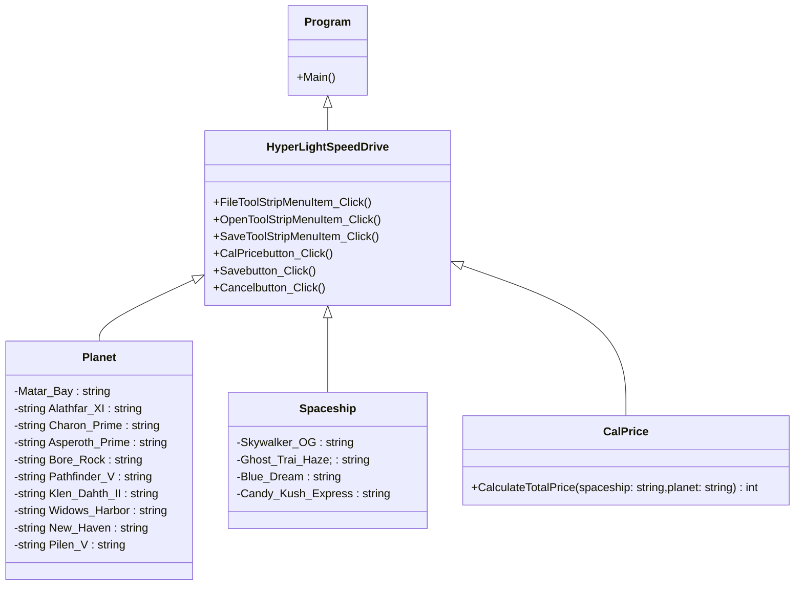

### ความเป็นมาของโปรแกรม
โปรมแกรมที่สร้างขึ้นมาคือ การจำลองจองตั๋วไปสำรวจดาวเคราห์อื่น เพราะว่า สร้างขึ้นมาจากความฝันที่จำลองถึงการผจญภัยในอวกาศ ล่องลอยเหนือเมฆ ท่ามกลางหมู่ดาว ระหว่างดวงดาวต่างๆ

  
### วัตถุประสงค์ของโปรแกรม
เพื่อกระตุ้นความคิดสร้างสรรค์และสร้างแรงบันดาลใจให้ผู้คนใฝ่ฝันถึงการสำรวจอวกาศ

  
### โครงสร้างของโปรแกรม (Class diagram)

  
### ชื่อของผู้พัฒนาโปรแกรม
643450789-0 ธนกร ภิรมย์กุล

